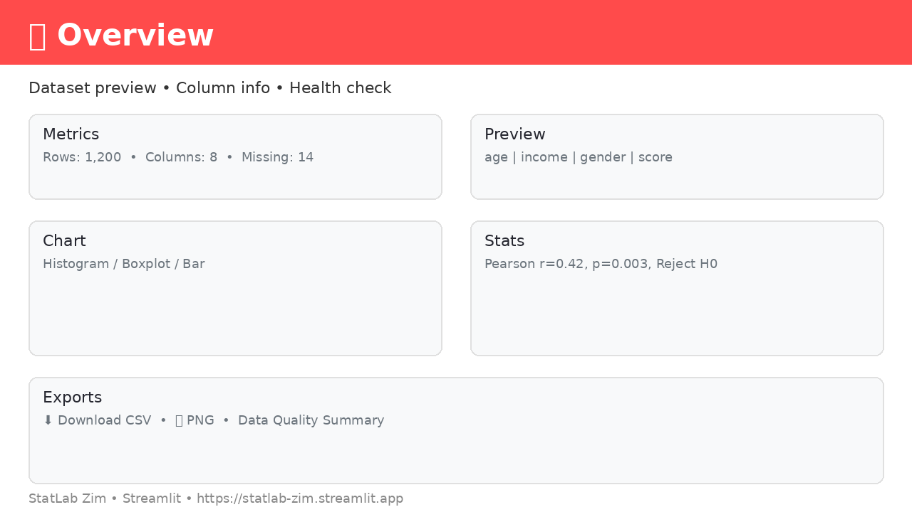
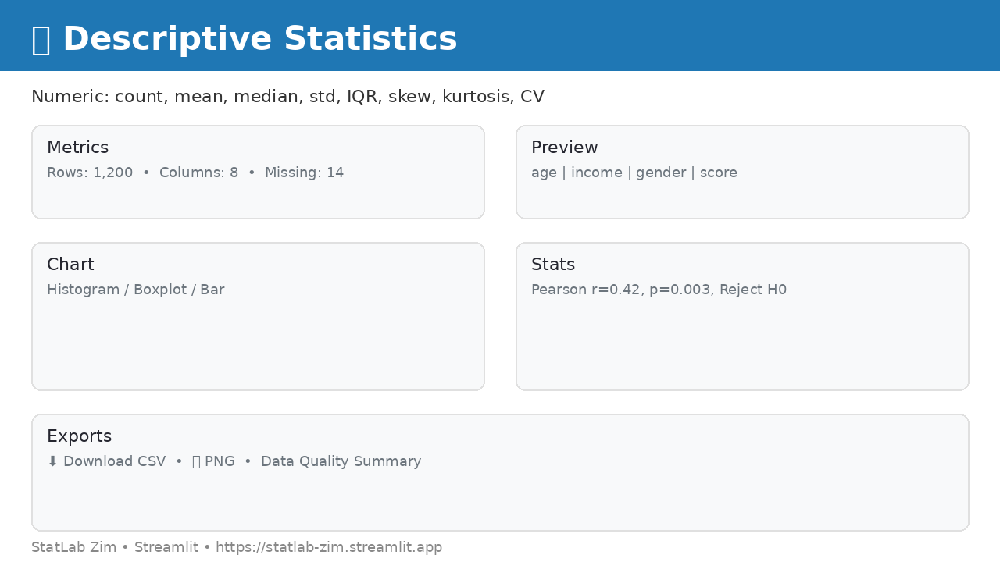
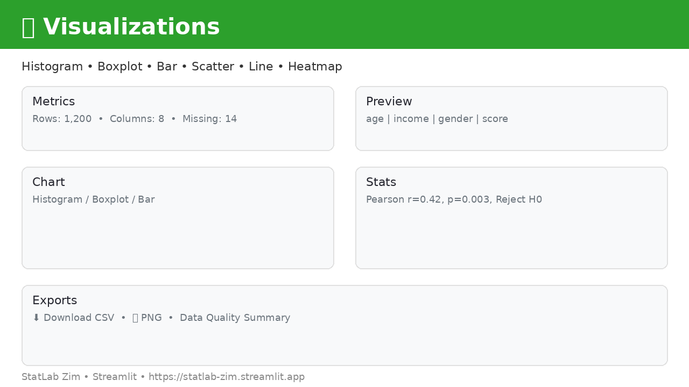
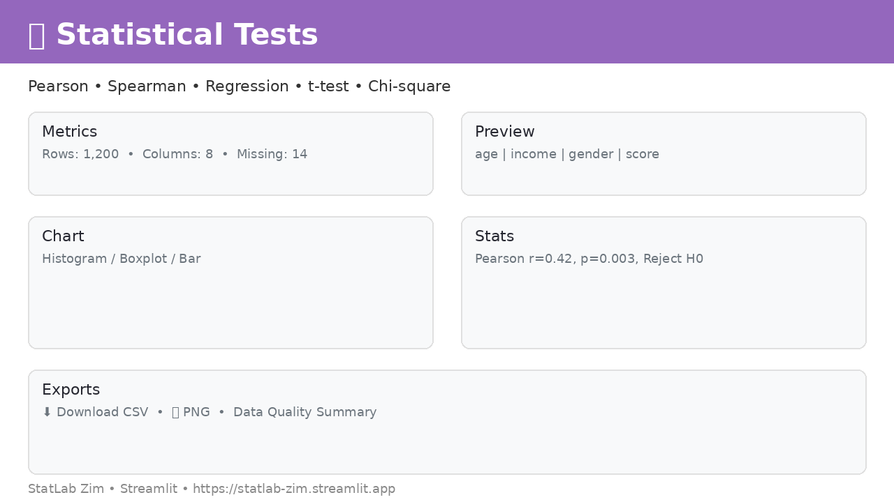
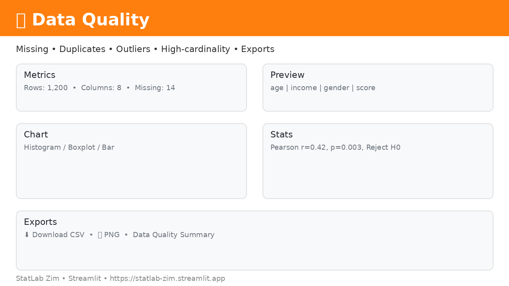

# 📊 StatLab Zim

> **Live App:** https://statlab-zim.streamlit.app — Upload a CSV and explore your data in seconds.

StatLab Zim is a web application for **learning and applying basic statistics** — built for students, researchers, and small businesses in Zimbabwe and beyond. Upload any CSV dataset to explore its structure, run descriptive analyses, visualize distributions and relationships, and perform common statistical tests — all with plain-language interpretations and one-click exports.


---

## ✨ Features

### Milestones 1–6 — Core App
- **Upload & Preview:** Drag-and-drop CSV upload (UTF-8, comma-separated), header validation, empty-file handling
- **Dataset Overview:** Row/column counts, missing-value counts, duplicate detection, column types & unique values
- **Data Quality Dashboard:** Per-column `inferred_type` (numeric/categorical/date/bool/text), missing %, constant/empty flags, high-cardinality detection (>50 uniques), IQR outlier flags

### Milestone 6 — Descriptive Statistics
- **Numeric Summary:** Count, mean, median, std (ddof=1), var, min, max, Q1 (25%), Q2 (50%), Q3 (75%), IQR, **skewness**, **kurtosis**, **CV %** — rounded display + full-precision CSV
- **Categorical Summary:** Per-column `n_categories`, `most_common` value + count, plus per-column **frequency table** (`Category, Count, Proportion, Percentage`) and download

### Milestone 7 — Visualizations
- **Histogram** — numeric selector + bins slider (5–100)
- **Boxplot** — median, quartiles, whiskers, outliers
- **Bar Chart** — categorical frequency
- **Scatter Plot** — X/Y numeric selectors with same-variable guard
- **Line Chart** — date + value columns (auto-detects `datetime64` + coerces string dates >50% parseable)
- **Correlation Heatmap** — `RdBu_r`, `zmin=-1/zmax=1`, `text_auto=True` + correlation matrix table

All charts are **interactive Plotly** (zoom, pan, hover) with **optional PNG export** via `kaleido` (graceful fallback if Chrome not installed).

### Milestone 8 — Statistical Tests
Each test shows: **test name, variables, H₀/H₁, statistic, p-value, alpha, decision (Reject/Fail), interpretation, assumptions, warnings**

| Test | Variables | Method |
|------|-----------|--------|
| **Pearson correlation** | 2 numeric | `scipy.stats.pearsonr` — linear correlation |
| **Spearman correlation** | 2 numeric/ordinal | `scipy.stats.spearmanr` — rank/monotonic |
| **Simple linear regression** | X numeric → Y numeric | `scipy.stats.linregress` — slope, intercept, R², trendline |
| **Independent t-test** | numeric + 2-group categorical | `scipy.stats.ttest_ind` (Welch, `equal_var=False`) |
| **Chi-square** | 2 categorical | `scipy.stats.chi2_contingency` — observed vs expected |

Global `α` slider in sidebar (0.01–0.10) + per-test override.

### Milestone 9 — Export/Download
- **Dataset:** uploaded CSV
- **Column info, numeric/categorical summaries, frequency tables** — CSV
- **Data Quality:** `statlab_column_quality_summary.csv` + `statlab_data_quality_summary.csv` (high-level metrics) + `statlab_outlier_flags.csv`
- **Correlation matrix** — CSV
- **Statistical tests:** single-test CSV + **combined** `statlab_all_test_results.csv`
- **Charts:** PNG via `fig.to_image(format="png", scale=2)` (optional)

### Milestone 10 — Tests
~19 `pytest` tests covering: row/col counts, missing-value %, duplicate detection, numeric-column detection, descriptive spot-checks, empty/invalid file handling, high-cardinality, outlier flags, CSV & PNG exports. Run: `pytest -v`.

### Milestone 11 — Polish
- Emoji headings, `help=` tooltips on every selector, `st.spinner` on heavy ops, friendly empty-states (`No numeric columns found… check formatting`), `st.success`/`st.warning` health indicators, improved variable selection (placeholder, help, columns layout), duplicate-column & header-only warnings, parser error handling.

---

## 🖼️ Screenshots

| Page | Preview |
|------|---------|
| **Overview** |  |
| **Descriptive Statistics** |  |
| **Visualizations** |  |
| **Statistical Tests** |  |
| **Data Quality** |  |

> Screenshots are auto-generated placeholders. Replace with real captures via `screenshots/README.md` instructions.

---

## 🚀 Usage

### Installation

```bash
git clone https://github.com/alfredshingai/statlab-zim.git
cd statlab-zim

python3 -m venv .venv
source .venv/bin/activate  # Windows: .venv\Scripts\activate

pip install -r requirements.txt
```

### Run Locally

```bash
streamlit run app.py
# → Local URL: http://localhost:8501
```

### Using the App

1. **Open** http://localhost:8501 (or the **Live App** link above).
2. **Upload** a CSV file (first row = header, comma-separated, UTF-8).
3. **Navigate** via sidebar:
   - **Overview** — preview + health check (missing/duplicates)
   - **Descriptive Statistics** — numeric & categorical tables + downloads
   - **Visualizations** — histogram/boxplot/bar/scatter/line/heatmap + PNG
   - **Statistical Tests** — Pearson, Spearman, regression, t-test, chi-square + interpretations + CSVs
   - **Data Quality** — type summary, outlier flags, high-cardinality warnings + exports
4. **Download** results via `⬇️` buttons next to each table/chart.

### Example CSV

```csv
age,income,gender,date,score
24,34000,M,2023-01-01,78
31,52000,F,2023-01-02,85
27,,F,2023-01-03,92
```

---

## 🧮 Methods & Formulas

- **Mean:** `Σx / n` · **Median:** 50th percentile · **Std/Var:** sample (`ddof=1`)
- **Quartiles:** `quantile(0.25)`, `0.50`, `0.75` · **IQR:** `Q3 − Q1`
- **Skewness:** `pandas.Series.skew()` · **Kurtosis:** `pandas.Series.kurt()` (Fisher excess, 0 = normal)
- **CV:** `std / mean × 100%` (NaN if mean=0)
- **Pearson r:** `pearsonr(x,y)` — tests H₀: r=0, decision: p<α ⇒ Reject
- **Spearman ρ:** `spearmanr(x,y)` — rank-based, robust to outliers
- **Linear regression:** `linregress(x,y)` → slope, intercept, `r²`, `p`, `stderr`, `slope/se` statistic; equation `y = slope·x + intercept`
- **Welch t-test:** `ttest_ind(g1,g2,equal_var=False)` — H₀: means equal
- **Chi-square:** `chi2_contingency(contingency)` → χ², p, dof, expected; warning if expected <5

**Assumptions shown in UI:** normality/linearity for Pearson, monotonic for Spearman, linearity/homoscedasticity/normal residuals for regression, normality per group for t-test, `expected ≥5` for chi-square.

---

## ⚠️ Limitations

- **Not a replacement for expert statistical advice** — results are educational; check assumptions (e.g., residual plots, normality) beyond the app.
- **CSV only** (`.csv`), UTF-8, comma-delimited, header required; Excel, large files (>200 MB), or non-UTF-8 may fail — see error banner guidance.
- **Missing data:** handled via `dropna` per analysis; no imputation. Columns with all missing are flagged as empty.
- **Date parsing:** auto-detects `datetime64` or coerces string dates if >50% parseable; ambiguous formats (e.g., `01/02/03`) may mis-parse — use ISO `YYYY-MM-DD`.
- **High-cardinality:** categorical columns >50 uniques flagged; chi-square with sparse cells warns `expected <5`.
- **Constant / low-n:** constant variables give `NaN` correlations, warnings; tests need ≥3 observations (≥2 per group for t-test/ANOVA).
- **PNG export:** requires `kaleido` 1.4+ with Chrome (`plotly_get_chrome`). If Chrome missing, PNG buttons show fallback caption — CSVs always work.
- **Performance:** in-memory `pandas`; very large datasets (>500k rows) may be slow on Streamlit Community Cloud (1 GB RAM limit).

---

## 🏗️ Project Structure

```
statlab-zim/
├── app.py                 # Streamlit app — 5 pages, spinners, downloads, polished UI
├── requirements.txt       # streamlit, pandas, numpy, scipy, statsmodels, plotly, kaleido, pytest
├── src/
│   ├── data_quality.py    # is_numeric/categorical/date, column_type_summary, data_quality_summary
│   ├── descriptive.py     # numeric_descriptive_summary, categorical_frequency_table/overview
│   ├── visualizations.py  # histogram/box/bar/scatter/line/heatmap + column helpers
│   ├── stats_tests.py     # pearson/spearman/linear/t_test/chi2 with full reporting dicts
│   └── export.py          # CSV/PNG export utilities (Milestone 9)
├── tests/
│   └── test_data_quality.py # 19 tests — counts, missing, duplicates, numeric detection, descriptive, empty/invalid
├── screenshots/           # placeholder PNGs (generated via Pillow)
├── data/ docs/ notebooks/ # reserved for datasets, docs, experiments
└── .streamlit/
    └── config.toml        # Streamlit Cloud config (theme, server)
```

---

## 🧪 Testing

```bash
pytest -v                 # 19 tests
pytest -v --tb=short      # concise failures
.venv/bin/python -m py_compile app.py src/*.py  # syntax check
```

Tests cover: row/col counts, missing-value % (including `is_empty` columns), `duplicate_row_count`, `is_numeric_series` (bool excluded), descriptive spot-checks (mean/median/Q1/Q3/IQR/std/var/CV with `pytest.approx`), constant-column handling, categorical frequency proportions, empty DataFrames (0 rows/0 cols), header-only CSVs, invalid CSVs, high-cardinality (>50), outlier IQR flags, and export CSV/PNG.

---

## ☁️ Deployment (Streamlit Cloud)

1. **Push to GitHub** (already at `alfredshingai/statlab-zim`):
   ```bash
   git add README.md requirements.txt app.py src/ tests/ screenshots/ .streamlit/
   git commit -m "Milestone 12: expand README, screenshots, deploy"
   git push origin main
   ```
2. **Deploy** on [share.streamlit.io](https://share.streamlit.io):
   - **New app** → Repository: `alfredshingai/statlab-zim` → Branch: `main` → Main file: `app.py`
   - Add `Python 3.12` in **Advanced settings** → **Deploy**
3. **Live link:** `https://statlab-zim.streamlit.app` (add badge above). If your app URL differs, update the top badge and `## Live App` section.

> **Local deploy verification:** `streamlit run app.py --server.headless true --server.port 8501` should show `Uvicorn server started`.

---

## 🛠️ Tech Stack

- **Python 3.12** · **Streamlit 1.62** · **pandas 2.2** · **numpy 2.0** · **scipy 1.14** · **statsmodels 0.14** · **plotly 7.0** · **kaleido 1.4** · **Pillow 11** · **pytest 8.3**
- **Lint/Format:** `py_compile` + manual review (no `black` enforced)

---

## 📄 License

MIT — see `LICENSE` (if missing, considered MIT as per original README).

## 🙏 Acknowledgements

Built for learners in Zimbabwe — inspired by ZIMSTAT open data and introductory stats courses. Contributions welcome via Issues/PRs.

---

**Questions?** Open an Issue at https://github.com/alfredshingai/statlab-zim/issues or use the app's sidebar tip.
